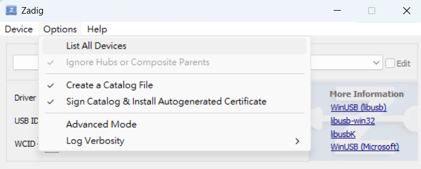
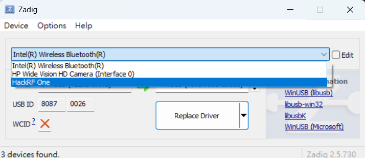
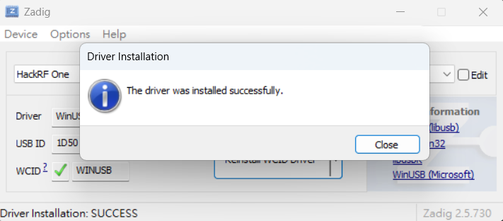
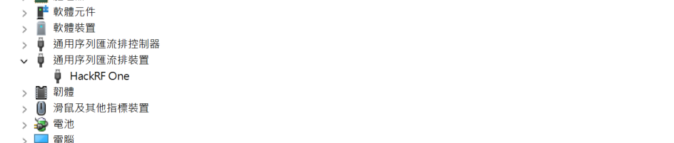
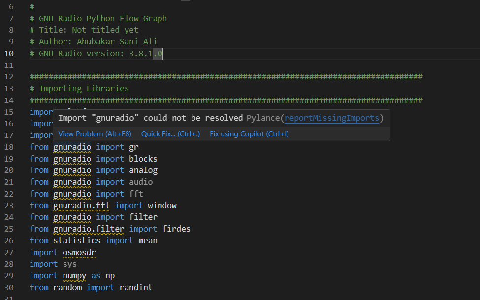
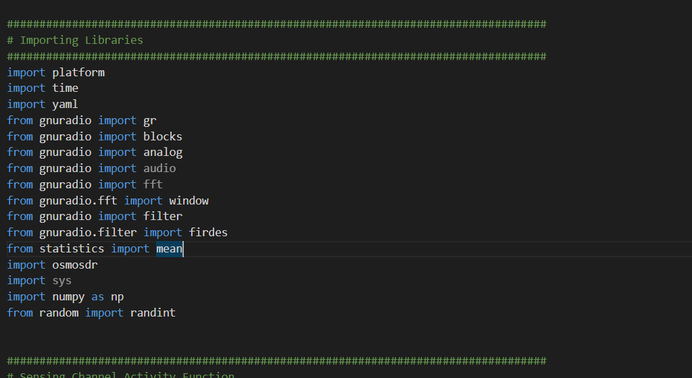
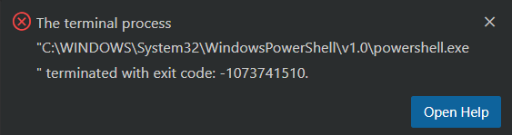

# HackRF One for Windows
A comprehensive tutorial for setting up and using HackRF One on Windows. This repository provides detailed step-by-step instructions, code samples, and troubleshooting tips—filling the gap left by Linux-focused guides. It also integrates modified code from [jamRF_v1.py](https://github.com/tiiuae/jamrf/blob/master/HackRF/jamRF_v1.py)

## Overview
HackRF One is a popular, low-cost, open-source software-defined radio (SDR) platform. While many setup guides assume a Linux environment, this project is tailored for Windows users. Whether you prefer using Conda, WSL, or Docker, this guide covers various methods to get you started.

## Features
- Step-by-step setup guide for HackRF One on Windows
- Windows-specific code samples and scripts
- Integration of selected functions from jamRF_v1.py
- Troubleshooting tips and FAQ

## Requirements
- **Operating System:** Windows 10 or later
- **Device:** HackRF One, Micro USB cable (for connecting HackRF to your PC)
- **Python:** Version 3.6 or higher

## Contents
- **[Conda Setup](#conda-setup)**
- **[WSL Setup](#wsl-setup)**
- **[Docker Setup](#docker-setup)**
- **[Troubleshooting](#troubleshooting)**

## Conda Setup
1. Prepare Essentials:
   - Download and install [Git](https://git-scm.com/downloads) and [Miniconda](https://www.anaconda.com/download/success) (or Anaconda).
3. Connect and Verify HackRF One
   - Plug in your HackRF One with a micro USB cable.
   - Open the Device Manager to check if your PC recognizes the device.
   - If not recognized properly, download and run [Zadig](https://zadig.akeo.ie/):
      - Click on List All Devices.
         
      - From the drop-down menu, select HackRF One.
         
      - Click Downgrade WCID Driver to install the driver.
         
      - Confirm in Device Manager that the HackRF One now appears correctly.
         

4. Clone the Repository
   Open a Command Prompt and run:
   ```
   git clone https://github.com/whiteSHADOW1234/HackRF-One-for-Windows.git
   ```
   This will download the files `jamRF_v1.py` and `config_v1.yaml`.
5. Set Up the Python Environment
   Open the cloned repository in Visual Studio Code (or your preferred editor). If you notice unresolved packages, 
   Continue with these commands in the Command Prompt:
   ```
   conda create -n hackrf_env -c conda-forge gnuradio gr-osmosdr hackrf
   conda activate hackrf_env
   ```
   
   Then, in VSCode, change the Python interpreter to `hackrf_env` and restart the terminal 
   
      - This may require restarting twice to resolve all issues.
         
  

6. Verify and Run
   - In the terminal, run the following command to ensure HackRF One details are displayed.
      ```
      > hackrf_info
      hackrf_info version: 2024.02.1
      libhackrf version: 2024.02.1 (0.9)
      Found HackRF
      Index: 0
      Serial number: 0000000000000000a18c63dc2b3c6813
      Board ID Number: 2 (HackRF One)
      Firmware Version: v2.0.1 (API:1.08)
      Part ID Number: 0xa000cb3c 0x00614766
      Hardware Revision: older than r6
      Hardware supported by installed firmware:
         HackRF One
      ```

   - Run `python jamRF_v1.py` in the terminal
      ```
      > python jamRF_v1.py
      1 100
      JAM!

      The frequency currently jammed is: 2412.0MHz
      gr-osmosdr 0.2.0.0 (0.2.0) gnuradio 3.10.12.0
      built-in sink types: uhd hackrf bladerf soapy redpitaya file 
      Using HackRF One with firmware v2.0.1
      Detected Windows OS
      100
      pagesize :debug: Setting pagesize to 4096 B
      top_block_impl :debug: Using default scheduler "TPB"
      UUUUUUUU
      ```
## WSL Setup
1. Install Prerequisites:
   - Install [Git](https://git-scm.com/downloads) and [WSL](https://learn.microsoft.com/en-us/windows/wsl/install) with a Linux distrobution (take Ubuntu for example).
   - Install usbipd-win (.msi) from its [GitHub releases](https://github.com/dorssel/usbipd-win/releases).
2. Connect and Verify HackRF One
   - Plug in your HackRF One with a micro USB cable.
   - Open the Device Manager to check if your PC recognizes the device.
   - If not, run [Zadig](https://zadig.akeo.ie/), select List All Devices, choose HackRF One, and click Downgrade WCID Driver.

3. Clone the Repository
   Open a Command Prompt and run:
   ```
   git clone https://github.com/whiteSHADOW1234/HackRF-One-for-Windows.git
   ```
   This will download the files `jamRF_v1.py` and `config_v1.yaml`.
4. Install Linux Dependencies in WSL:
   - Open PowerShell and list your WSL distributions
      ```
      wsl --list --verbose
      ```
   - Launch your chosen Linux distribution:
      ```
      wsl -d <YOUR_LINUX_DISTRIBUTION>
      ```
   - Install the necessary packages
      ```
      sudo apt-get install gqrx gnuradio gr-osmosdr hackrf libhackrf-dev gnuradio-dev gr-iqbal gqrx-sdr
      ```
   - Verify HackRF detection (It might not detect the device like the following output):
      ```
      > lsusb
      Bus 002 Device 001: ID 1d6b:0003 Linux Foundation 3.0 root hub
      Bus 001 Device 001: ID 1d6b:0002 Linux Foundation 2.0 root hub
      ```
5. Bind the HackRF USB Port to WSL:
   - In a new PowerShell window, list connected USB devices:
      ```
      > usbipd list
      Connected:
      BUSID  VID:PID    DEVICE                                                        STATE
      2-1    1d50:6089  HackRF One                                                    Not shared
      2-3    30c9:000e  HP Wide Vision HD Camera                                      Not shared
      2-10   8087:0026  Intel(R) Wireless Bluetooth(R)                                Not shared

      Persisted:
      GUID                                  DEVICE
    
      ```
   - Bind and attach HackRF (replace <BUSID> with your HackRF’s bus ID):
      ```
      > usbipd bind --busid 2-1
      > usbipd list
      Connected:
      BUSID  VID:PID    DEVICE                                                        STATE
      2-1    1d50:6089  HackRF One                                                    Shared
      2-3    30c9:000e  HP Wide Vision HD Camera                                      Not shared
      2-10   8087:0026  Intel(R) Wireless Bluetooth(R)                                Not shared

      Persisted:
      GUID                                  DEVICE
      
      
      > usbipd attach --wsl --busid 2-1
      > usbipd list
      Connected:
      BUSID  VID:PID    DEVICE                                                        STATE
      2-1    1d50:6089  HackRF One                                                    Attached
      2-3    30c9:000e  HP Wide Vision HD Camera                                      Not shared
      2-10   8087:0026  Intel(R) Wireless Bluetooth(R)                                Not shared

      Persisted:
      GUID                                  DEVICE
      ```
   - Confirm the attachment by rechecking in the old window with:
      ```
      > lsusb
      Bus 002 Device 001: ID 1d6b:0003 Linux Foundation 3.0 root hub
      Bus 001 Device 002: ID 1d50:6089 OpenMoko, Inc. Great Scott Gadgets HackRF One SDR
      Bus 001 Device 001: ID 1d6b:0002 Linux Foundation 2.0 root hub
      ```
6. Test and Run
   - In WSL, run the following command to ensure HackRF is recognized.
      ```
      $ hackrf_info
      hackrf_info version: unknown
      libhackrf version: unknown (0.6)
      Found HackRF
      Index: 0
      Serial number: 0000000000000000a18c63dc2b3c6813
      Board ID Number: 2 (HackRF One)
      Firmware Version: v2.0.1 (API:1.08)
      Part ID Number: 0xa000cb3c 0x00614766
      ```
   - Navigate to the cloned repository and execute the script
      ```
      $ python3 jamRF_v1.py
      1 100
      JAM!

      The frequency currently jammed is: 2412.0MHz
      gr-osmosdr 0.2.0.0 (0.2.0) gnuradio 3.10.1.1
      built-in sink types: uhd hackrf bladerf soapy redpitaya freesrp file
      [INFO] [UHD] linux; GNU C++ version 11.2.0; Boost_107400; UHD_4.1.0.5-3
      libusb: warning [libusb_exit] device 2.1 still referenced
      libusb: warning [libusb_exit] device 1.2 still referenced
      libusb: warning [libusb_exit] device 1.1 still referenced
      Using HackRF One with firmware v2.0.1
      Detected Linux OS
      100
      UUUUUUUUUU
      ```

## Docker Setup


## Troubleshooting
1. Device Not Found
   - Error:
      ```
      Exception has occurred: RuntimeError
      Failed to use '0' as HackRF device index: not enough devices
      File "C:\Users\<USER_NAME>\Desktop\HackRF-One-for-Windows\jamRF_v1.py", line 130, in jam
         osmosdr_sink = osmosdr.sink("hackrf=0")
                        ^^^^^^^^^^^^^^^^^^^^^^^^
      File "C:\Users\<USER_NAME>\Desktop\HackRF-One-for-Windows\jamRF_v1.py", line 271, in <module>
         jam(freq, waveform, power, t_jamming)
      RuntimeError: Failed to use '0' as HackRF device index: not enough devices
      ```
   - Solution:
      Try switching to a different USB port or update the USB driver.
2. Device Misidentification
   - Observation
      When running `usbipd list`, HackRF appears as a `USBIP Shared Device` (and similarly in **Device Manager**) instead of `HackRF One`.
   - Solution
      Update the USB driver, unplug and replug the HackRF, or use a different USB port.

3. DLL Errors
   - Error
      ```
      python jamRF_v1.py
      Traceback (most recent call last):
      File "C:\Users\<USER_NAME>\miniconda3\envs\hackrf_env\Lib\site-packages\gnuradio\blocks\__init__.py", line 18, in <module>
         from .blocks_python import *
      ImportError: DLL load failed while importing blocks_python: 找不到指定的模組。

      During handling of the above exception, another exception occurred:

      Traceback (most recent call last):
      File "C:\Users\<USER_NAME>\Desktop\WiFi-Jamming\jamRF_v1.py", line 19, in <module>
         from gnuradio import blocks
      File "C:\Users\<USER_NAME>\miniconda3\envs\hackrf_env\Lib\site-packages\gnuradio\blocks\__init__.py", line 22, in <module>
         from .blocks_python import *
      ImportError: DLL load failed while importing blocks_python: 找不到指定的模組。
      ```
   - Solution
      Remove any conflicting conda environments or WSL distrobutions to ensure only one is accessing the HackRF device.

4. Access Denied error, even when running as Administrator.
   - Error
      ```
      $ hackrf_info
      hackrf_info version: unknown
      libhackrf version: unknown (0.6)
      Found HackRF
      Index: 0
      hackrf_open() failed: Access denied (insufficient permissions) (-1000)
      ```
   - Solution
      Remove any conflicting conda environments or WSL distrobutions to ensure only one is accessing the HackRF device.
5. `avahi_service_browser_new()` Failed
   - Error
      ```
      python3 jamRF_v1.py
      1 100
      JAM!

      The frequency currently jammed is: 2412.0MHz
      gr-osmosdr 0.2.0.0 (0.2.0) gnuradio 3.10.1.1
      built-in sink types: uhd hackrf bladerf soapy redpitaya freesrp file
      [INFO] [UHD] linux; GNU C++ version 11.2.0; Boost_107400; UHD_4.1.0.5-3
      [ERROR] avahi_service_browser_new() failed: Bad state
      libusb: warning [libusb_exit] device 2.1 still referenced
      libusb: warning [libusb_exit] device 1.2 still referenced
      libusb: warning [libusb_exit] device 1.1 still referenced
      Using HackRF One with firmware v2.0.1
      100
      vmcircbuf_prefs::get :error: /home/huang/.gnuradio/prefs/vmcircbuf_default_factory: No such file or directory
      gr::vmcircbuf :error: vmcircbuf_createfilemapping: createfilemapping is not available
      ```
   - Solution
      Install `avahi-daemon` by executing `sudo apt install avahi-daemon -y` in the WSL distrobution will fix.